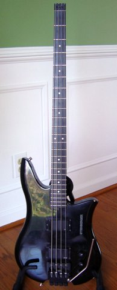
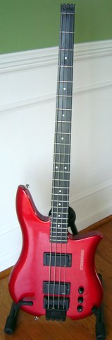
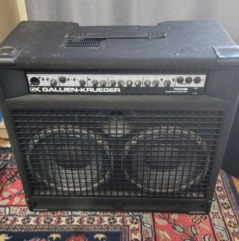
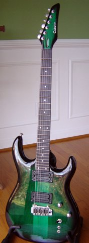
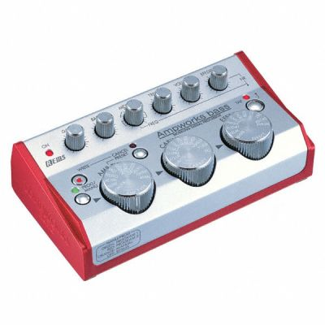
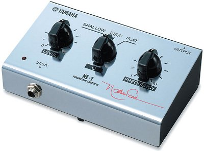
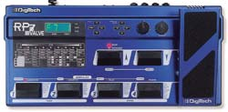

## Raven

I love the heavy metal band [Raven](https://ravenlunatics.com/). Thanks to eBay, I've managed to pull together a decent collection of old Raven clippings from the 80s. 

- <a href="img/album_dnym.jpg" TARGET="_blank">Don't Need Your Money Promo Album (circa 1981)</a>
- <a href="img/ad_raven_metalica.jpg" TARGET="_blank">Advertisement for img/Metalica [sic] Show (circa 1983)</a>
- <a href="img/article_k83.jpg" TARGET="_blank">1983 Kerrang Clipping</a>
- <a href="img/article_k84.jpg" TARGET="_blank">1984 Kerrang Clipping</a>
- <a href="img/ad_lati84.jpg" TARGET="_blank">1984 Live at the Inferno Advertisement</a>
- <a href="img/photo_group02.jpg" TARGET="_blank">Group Photo (circa 1985)</a>
- <a href="img/article_85.jpg" TARGET="_blank">1985 article</a>
- <a href="img/article_hp85_01.jpg" TARGET="_blank">1985 Hit Parader Article (page 1)</a>
- <a href="img/article_hp85_02.jpg" TARGET="_blank">1985 Hit Parader Article (page 2)</a>
- <a href="img/photo_group01.jpg" TARGET="_blank">Group Photo (circa 1986)</a>
- <a href="img/article_86.jpg" TARGET="_blank">1986 article</a>
- <a href="img/article_me86_01.jpg" TARGET="_blank">1986 Metal Edge Article (page 1)</a>
- <a href="img/article_me86_02.jpg" TARGET="_blank">1986 Metal Edge Article (page 2)</a>
- <a href="img/article_me86_03.jpg" TARGET="_blank">1986 Metal Edge Article (page 3)</a>
- <a href="img/article_hrms86.jpg" TARGET="_blank">1986 Hard Rock Metal Studs Article </a>
- <a href="img/article_pm89.jpg" TARGET="_blank">1989 Power Metal Article</a>
- <a href="img/photo_wacko.jpg" TARGET="_blank">Cool Photo of Wacko!</a>
- <a href="img/photo_wacko2.jpg" TARGET="_blank">Photo of Wacko at a Long Island show</a>
- <a href="img/photo_wacko_mark.jpg" TARGET="_blank">Photo of Wacko and Mark at a Long Island show</a>
- <a href="img/mark_gallagher_guitar_contest.jpg" TARGET="_blank">"Win an ESP Guitar as used by Raven's Mark Gallagher" - Kerrang! Contest</a>

## Tablature

Many years ago I tabbed out some of my favorite songs to play on bass.

### Journey

- <A HREF="tab/journey_dsb.txt" TARGET="_blank">Don't Stop Believin'</A>
- <A HREF="tab/journey_sil.txt" TARGET="_blank">Stone in Love</A>
- <A HREF="tab/journey_wcn.txt" TARGET="_blank">Who's Crying Now</A>
- <A HREF="tab/journey_doa.txt" TARGET="_blank">Dead or Alive</A>

### Raven

- <A HREF="tab/rav_3940.txt" TARGET="_blank">39-40</A>
- <A HREF="tab/rav_ftf.txt" TARGET="_blank">For the Future</A>
- <A HREF="tab/rav_ruyd.txt" TARGET="_blank">Rock Until You Drop</A>
- <A HREF="tab/rav_wo.txt" TARGET="_blank">Wiped Out</A>
- <A HREF="tab/rav_inq.txt" TARGET="_blank">Inquisitor</A>
- <A HREF="tab/rav_tc.txt" TARGET="_blank">Take Control</A>
- <A HREF="tab/rav_mom.txt" TARGET="_blank">Mind Over Metal</A>
- <A HREF="tab/rav_afo.txt" TARGET="_blank">All for One</A>
- <A HREF="tab/rav_tbl.txt" TARGET="_blank">The Bottom Line</A> <I>bass intro only</I>
- <A HREF="tab/rav_yb.txt" TARGET="_blank">Young Blood</A>
- <A HREF="tab/rav_nr.txt" TARGET="_blank">Nightmare Ride</A>
- <A HREF="tab/rav_sotr.txt" TARGET="_blank">Speed of the Reflex</A>
- <A HREF="tab/rav_dod.txt" TARGET="_blank">Do or Die</A>
- <A HREF="tab/rav_hdsc.txt" TARGET="_blank">How Did Ya Get So Crazy</A>
- <A HREF="tab/rav_sotv.txt" TARGET="_blank">Seen it on the T.V.</A>
- <A HREF="tab/rav_gjal.txt" TARGET="_blank">Gimmie Just a Little</A>
- <A HREF="tab/rav_sah.txt" TARGET="_blank">The Savage and the Hungry</A>
- <A HREF="tab/rav_lab.txt" TARGET="_blank">Life's a Bitch</A>
- <A HREF="tab/rav_il.txt" TARGET="_blank">Iron League</A> 
- <A HREF="tab/rav_wings.txt" TARGET="_blank">On the Wings of an Eagle</A> <I>bass intro only</I>
- <A HREF="tab/rav_fott.txt" TARGET="_blank">Finger on the Trigger</A>
- <A HREF="tab/rav_ldtl.txt" TARGET="_blank">Lay Down the Law</A>
- <A HREF="tab/rav_scre.txt" TARGET="_blank">You Got a Screw Loose</A>
- <A HREF="tab/rav_wha.txt" TARGET="_blank">White Hot Anger</A> 
- <A HREF="tab/rav_d.txt" TARGET="_blank">Derailed</A>

### Sword

- <A HREF="tab/swd_ftw.txt" TARGET="_blank">F.T.W.</A>
- <A HREF="tab/swd_wth.txt" TARGET="_blank">Where to Hide</A>
- <A HREF="tab/swd_lse.txt" TARGET="_blank">Life on the Sharp Edge</A>
- <A HREF="tab/swd_sos.txt" TARGET="_blank">State of Shock</A>

## My music gear

I don't play as much as I used to, but I love my music gear.

### Black Steinberger XQ4 with TransTrem

Purchased new in 1990. Serial number N11029. Had a Bass TransTrem factory installed in 1992. To my knowledge, the only XQ bass with a TransTrem. I play it with the bridge pick-up full on, the neck pick-up half way, and the tone about 60%. Tight string spacing facilitates fast playing. Graphite blend neck bolted on rock maple body. Very heavy, about 13 lbs. Stays in tune for weeks on end. Originally came with a DB bridge (Steinberger bridge with a Hip-shot style D-tuner for the E String). One gripe about the TransTrem: intonation has to be adjusted manually by pushing saddles back and forth with your fingers, as opposed to using a screwdriver or allen wrench.

### Red Steinberger XQ4

Purchased used in 2004. Serial number N10305. Exact same bass as my other XQ, except it has a standard Steinberger bridge.

### Gallien-Krueger 700RB/210

Purchased new in 2002.  Loud enough for most any gig. Simple to use. Wide range of sounds. I set it warm and tight by rolling back the "presence" and "contour" settings, keeping the EQ flat, and playing through my Yamaha NE-1. Built-in handle and rollers allow you to pull it like a suitcase. Unfortunately one of the rollers has dry rotted. Able to tilt back like a monitor, but is very unstable in this position. Concise and helpful user manual. 

### Carvin DC-127 with Wilkinson Tremolo

Purchased new in 2001. Serial number 64639. I had the good fortune of knowing someone with two Carvins, so I became familiar with the name and their instruments. When I decided to buy my own electric, the only question I had was which Carvin to buy. I went with the DC-127 because it was one of their less expensive models (about $600). The difference in it and other higher-priced models, as far as I can tell, is the pick-up configuration. Same neck-through-body construction, same hardware, same beautiful finish. Sounds great played acoustically. Plugged in, it does what you want: warm, bright, mellow, crisp, etc. Mine has [Sperzel tuners](https://sperzel.com/), which makes string changes super easy. 

### Korg Ampworks Bass Modeling Signal Processor

Purchased new in 2004. Serial number 005860.Makes playing and recording bass so much fun. Three big knobs give you a world of different of sounds. Mix and match modeled preamps, modeled cabinets, and a sound effect. My favorite is the "Jazz" preamp, 1x15 Jazz cabinet, and a touch of chorus. No matter the settings, I always set the treble back to about 10:00. It doesn’t come with a power supply, but has a 4.5 volt DC connector. It runs on two AA batteries for about 10 hours of continuous use. 

### Yamaha NE-1 Parametric Equalizer

The "NE" stands for Nathan East. Supposedly this unit is based on a custom-made unit Nathan uses in his rig. All this unit does is cut EQ. You can choose if want the cut to be "deep" or "shallow", and you can choose the frequency. The frequencies are not labeled. It’s an arbitrary 1 through 10. The user guide sort of tells you which frequencies are available, but only with a picture of a graph. You can’t determine exactly which frequency you’re cutting on, say, Deep 7. From the picture it looks like about 800 kHz. The setting I use is Nathan’s setting, Deep 4. It’s a -20 dB cut at 2000 kHz. The creates a warm growl and you can barely hear your fingers scrape the strings. Only complaint about the NE-1: it only runs on a 9V battery. No power adapter jack.

### DigiTech RP7 Valve Pre-Amp

Purchased new in 1999. I use this mostly for recording my guitar direct. Usable pre-sets, good variety of distortion and reverb, and easy to program. Very tough unit, built to last. But lack of on-off switch is disappointing; it’s only on when plugged up. The power supply also doesn’t stay in the unit very well. One misstep and you lose power. The few times I’ve used it live I duct taped the power cord and that prevented any problems. Out of production.

## My Grandfather

On April 30, 1996, my grandfather, Billy Joe Ford, sat down in his kitchen and tape recorded his "life history". I'd like to think I'm the reason he took the time to do this. During my college years, I repeatedly pestered him to write down some of the stories he used to tell my sister and me. Not just the funny stories, but the details about working for 50 cents a day, living without electricity, missing the first six weeks of the school year due to harvesting cotton, and so forth. I thought the details of his amazing life were worth preserving. 

About two weeks before I got married in 1996, he surprised me with a cassette tape. On the front, written in my grandmother's handwriting, was "Papaw life to Clay April 30, 1996". He had 
recorded some stories and thought maybe I could transcribe it and type it up for him. I started to, but quickly realized a transcription of his recording would do it absolutely no justice. Papaw's stories aren't meant to be read, but heard. His accent, his pauses for breath, and his laughter are a joy to listen to.

He passed away in 2009 at the age of 82. These recordings mean the world to me.

- <a href="http://www.clayford.net/papaw/part_01.mp3" target="_new">Part 1 (6:43)</a> 
- <a href="http://www.clayford.net/papaw/part_02.mp3" target="_new">Part 2 (4:36)</a> 
- <a href="http://www.clayford.net/papaw/part_03.mp3" target="_new">Part 3 (5:21)</a> 
- <a href="http://www.clayford.net/papaw/part_04.mp3" target="_new">Part 4 (6:26)</a> 
- <a href="http://www.clayford.net/papaw/part_05.mp3" target="_new">Part 5 (3:33)</a> 
- <a href="http://www.clayford.net/papaw/part_06.mp3" target="_new">Part 6 (4:43)</a> 
- <a href="http://www.clayford.net/papaw/part_07.mp3" target="_new">Part 7 (1:23)</a> 

