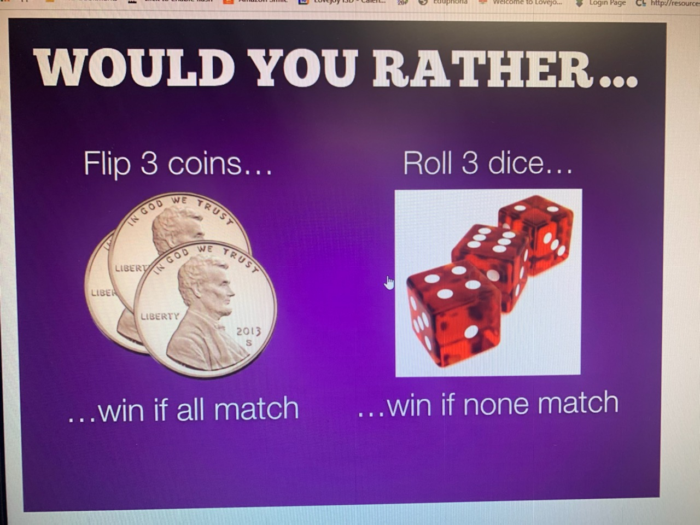

Someone texted me the following image and asked for my response.



So what would I rather do?

- Flip 3 coins and win if all match
- Roll 3 dice and win if none match

I would rather do the one with the highest probability of happening. So let's calculate that using R.

There are two ways to solve problems like this. One is to use the appropriate probability distribution and calculate it mathematically. The other is to enumerate all possible outcomes and find the proportion of interest. Let's do the latter first.

We'll use the `expand.grid` function to create a data frame of all possible outcomes of flipping a coin. All we have to do is give it 3 vectors representing coins. It's such a small sample space we can eyeball it and see the probability of getting all heads or all tails is 2/8 or 0.25.

```{r}
s1 <- expand.grid(c("H", "T"), c("H", "T"), c("H", "T"))
s1
```

If we wanted to use R to determine the proportion, we could use `apply` to apply a function each row and return the number of unique values, and then find the proportion of `1`s. (`1` means there was only one unique value: all "H" or all "T")

```{r}
count1 <- apply(s1, 1, function(x)length(unique(x)))
mean(count1 == 1)

```

We can do the same with rolling 3 dice. Give `expand.grid` 3 dice and have it generate the sample space. This will generate 216 possibilities, so there's no eyeballing this for an answer. As before, we'll apply a function to each row and determine if there are any duplicates. The `anyDuplicated` function returns the location of the first duplicate within a vector. If there are no duplicates, the result is a `0`, which means we just need to find the proportion of `0`s.

```{r}
s2 <- expand.grid(1:6, 1:6, 1:6)
count2 <- apply(s2, 1, anyDuplicated)
mean(count2 == 0)
```

Clearly we'd rather roll the dice (assuming fair coins and fair dice).

We can also answer the question using the binomial probability distribution. The binomial distribution is appropriate when you have:

- two outcomes (Heads vs Tales, no match vs One or more match)
- independent events
- same probability for each event

The `dbinom` function calculates probabilities of binomial outcomes. Below we use it to calculate the probability of 0 heads (3 tails) and 3 heads, and sum the total. The `x` argument is the sum of "successes", for example 0 heads (or tails, whatever you call a "success"). The `size` argument is the number of trials, or coins in this case. The `prob` argument is the probability of success on each trial, or for each coin in this case. 

```{r}
dbinom(x = 0, size = 3, prob = 0.5) + 
  dbinom(x = 3, size = 3, prob = 0.5)
```

We can also frame the dice rolling as a binomial outcome, but it's a little trickier. Think of rolling the dice one at a time: 

- It doesn't matter what we roll the first time. We don't care if it's a 1 or 6 or whatever. We're certain to get something, so the probability is 1.
- The second role is a "success" if it _does not_ match the first role. That's one dice roll (`size = 1`) where success (`x = 1`) happens with probability of 5/6.
- The third and final roll is a "success" if it doesn't match either of the first two rolls. That's one dice roll (`size = 1`) where success (`x = 1`) happens with probability of 4/6.

Notice we don't add these probabilities but rather _multiply_ them.

```{r}
1 * dbinom(x = 1, size = 1, prob = 5/6) *
  dbinom(x = 1, size = 1, prob = 4/6)
```

We added the coin flipping probabilities because they each represented mutually exclusive events. They cannot both occur. There is one way to get 0 successes and one way to get 3 successes. Together they sum to the probability of all matching (ie, all heads or all tales). 

We multiplied the dice rolling probabilities because they each represented events that could occur at the same time, and they were conditional if we considered each die in turn. This requires the multiplication rule of probability.


